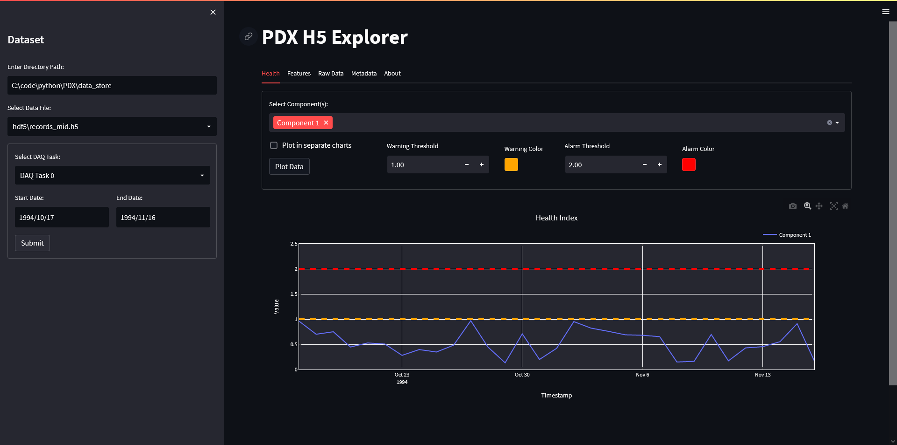
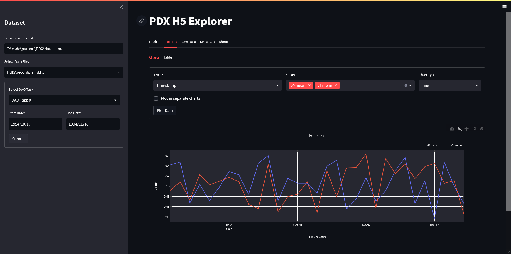
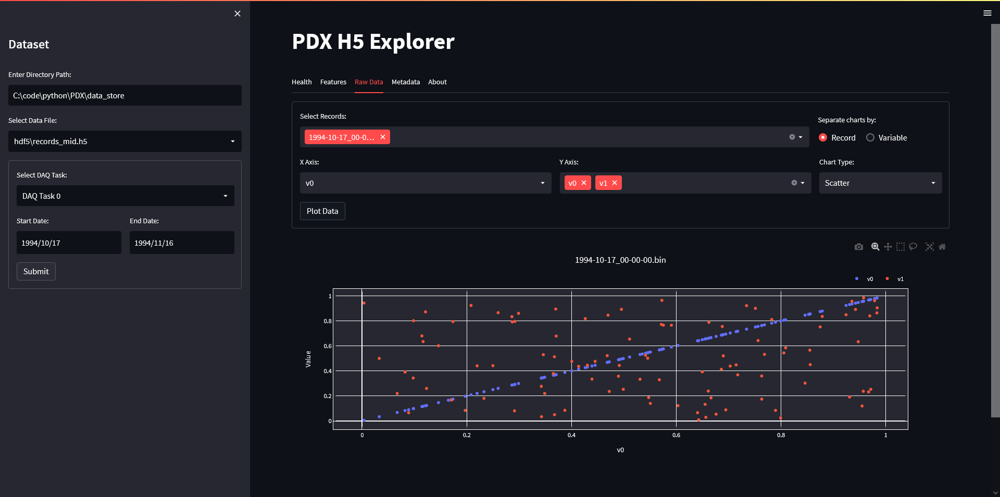
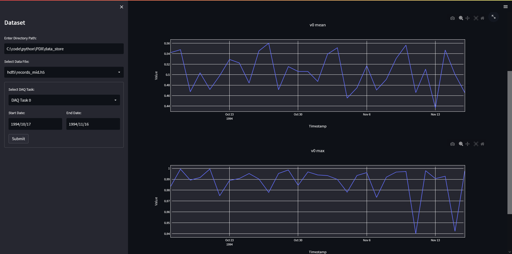
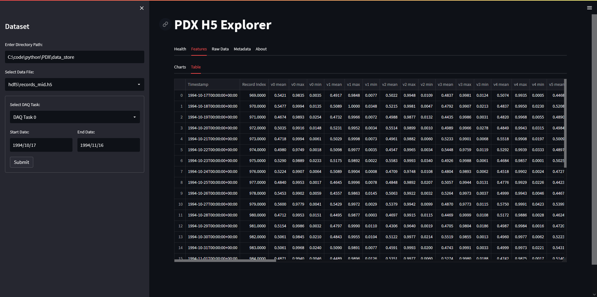

# PDX H5 Explorer
A tool to visualize data from HDF5/H5 data files that adhere to the PDX data structure.

## Screenshots
|                                              |                                                     |
| :------------------------------------------: | :-------------------------------------------------: |
|    |  |
|   |  |
|  |   |


## Features
- Data exploration of data tasks for a valid date range within a selected H5 file
- Health Data:
  - Chart health components together or in separate charts
  - View thresholds on charts
- Feature Data:
  - Chart feature(s) together or in separate charts
  - View features in tabular form
- Raw Data:
  - Chart data by record or by data variable
- View stored metadata in tabular form

## Installation
Install dependencies by running the `setup.ps1` script in a PowerShell terminal. This process will take a few minutes.

```shell
...\hdf5_explorer> .\setup.ps1
Beginning setup...
Invoke path : C:\code\python\PDX\hdf5_explorer
Script path : C:\code\python\PDX\hdf5_explorer
Python 3.10.5
.
.
.
Setup is complete. Run 'launch_app.ps1' to launch the app.
```

## Usage
Launch the app by running the `launch_app.ps1` script in a PowerShell terminal.

```shell
...\hdf5_explorer> .\launch_app.ps1
Launching app...
Hit Ctrl+C to quit at any time.
Invoke dir: C:\code\python\PDX\hdf5_explorer
Script dir: C:\code\python\PDX\hdf5_explorer
Activating virtual environment 'env'...
Python 3.10.5

  You can now view your Streamlit app in your browser.

  Local URL: http://localhost:8501
  Network URL: http://192.168.1.8:8501
```

## FAQs

**Q: Is this available as a binary executable?**

**A:** No.


**Q: My app is crashing/I found a bug!**

**A:** Please report all bugs by raising a GitHub issue using the "Bug report" template.


**Q: How can I request a new feature?**

**A:** Raise a GitHub issue using the "Feature request" template. Relevant feature requests are welcome, but you may have to contribute it yourself and raise a pull request (use a feature branch if you are contributing code).


## Contact
For anything not covered here, email [Varun Udupa](mailto:udupa@predictronics.com).


